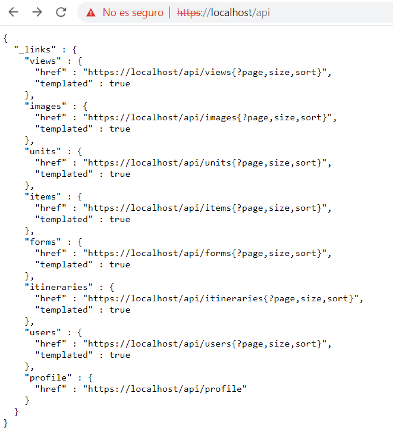
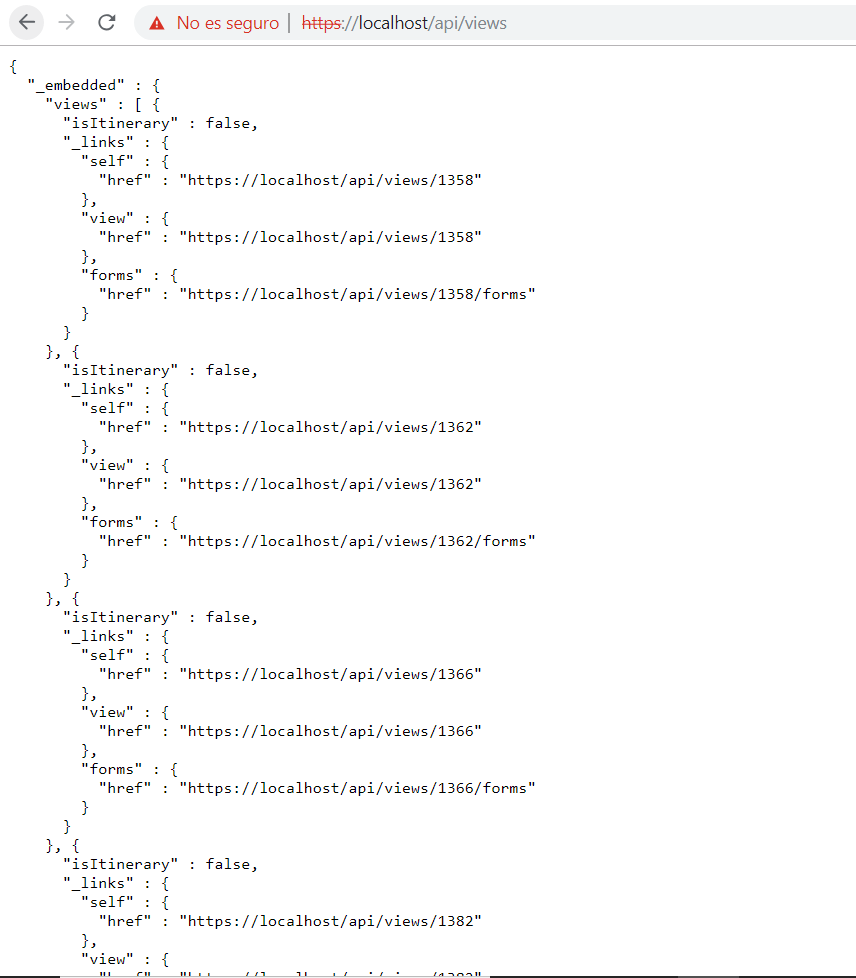
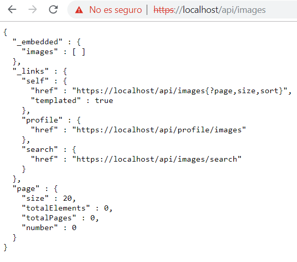
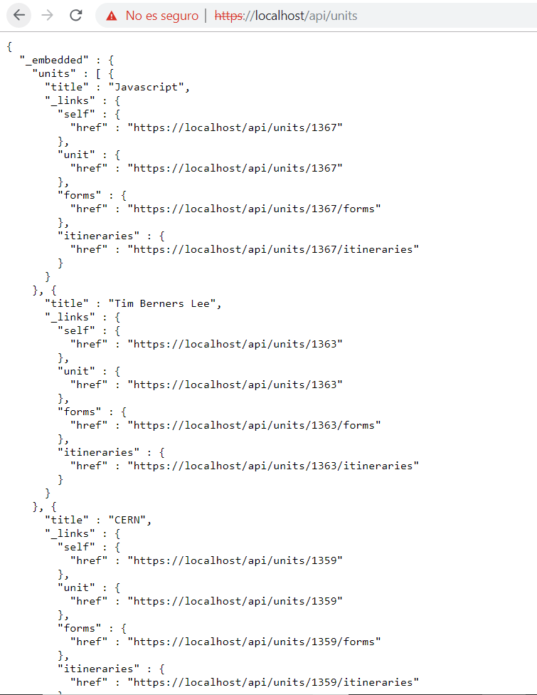
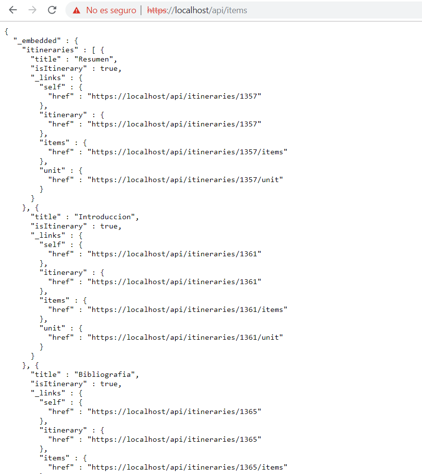
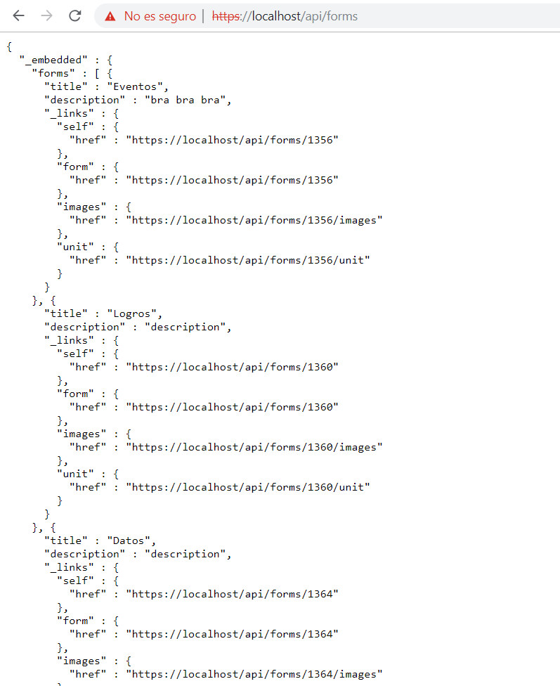
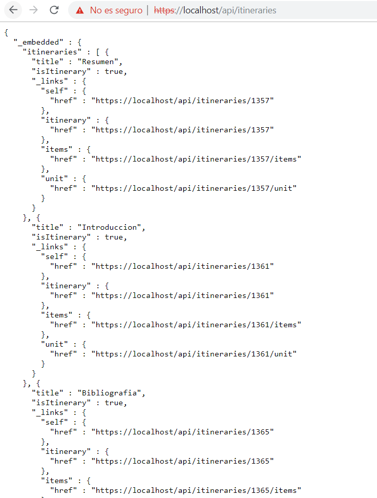
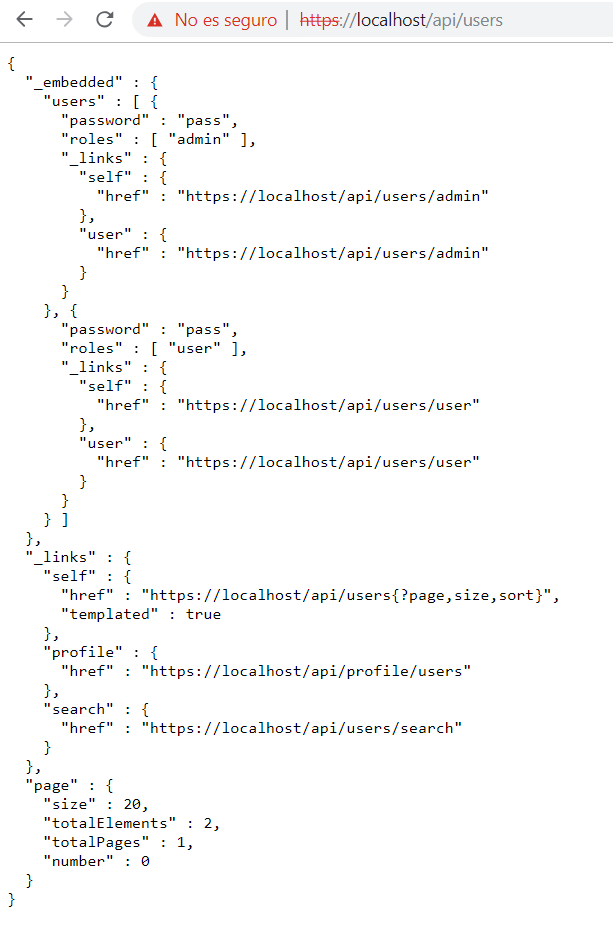

To begin, we will explain the functioning of the REST API that we have developed:

- For each type of entity that owns the application, the 4 main functionalities have been implemented: request (GET), create an object and add it to the database (POST), modify an object (PUT) and delete an object (DELETE) .

- The result that we obtain from each request is the requested object, except when we are using images, for which the image is returned. The object is shown in Json format, and can show up to two depth levels with respect to dependencies that have some objects over others.

- The data is passed to these methods as parameters that call the function or as attachments in the body of the request (with the annotation @RequestBody ...)

Our objects are:
    - View
    - Unit
    - Itinerary
    - Image
    - Form
    - Image
    - User
    
### URLs
    
    All our URLs will start with: https://localhost

    Then all our URLs related to the REST API will have the following format: first, it will be / api and then it will be / (the entity to which you want to access).

## api

This URL shows diferent API REST.

This URL shows a views lists. You can GET,POST or Delete forms.

This URL shows an images uploaded. You can GET,POST or DELETE the images.

This URL shows an units lists. For every unit you can GET, POST or DELETE itineraries or forms.

This URL shows an items lists. You can GET itineraries or view of this item.

This URL shows a forms lists.

This URL shows an itineraries lists. FOR every itinerary you can GET, POST or DELETE subitineraries.

This URL can POST the user that you want to create.

######EX:
- https://localhost/api/units/1367               One unit
- https://localhost/api/units/1367/forms         Form of this unit
- https://localhost/api/units/1367/itineraries   Itineraries of this unit

- https://localhost/api/views/136                One view
- https://localhost/api/views/1366/forms         Forms of this view

    All our URLs will start with: https://localhost .
    Then all our URLs related to the REST API will have the following format: first, it will be /api and then it will be / (the entity to which you want to access).
