# Gestor de Itinerarios

## Description
We must create a website, a "Gestor de Itinearios", the development of this work will be evaluated by phases, being the distribution of them as follow:
* Phase 0: Form the development team (Not evaluable)
* Phase 1: Layout of pages with HTML and CSS Bootstrap (Not evaluable)
* Phase 2: Implementation of the web with HTML generated in server and AJAX.
* Phase 3: Incorporation of REST API to the web application and deployment with docker
* Phase 4: Implementation of the web with SPA architecture

## Team Members

Name | University email | GitHub Account
------------ | ------------------------- | -------------
ShuXiang Gao | s.gao.2016@alumnos.urjc.es | vitaminac
ZiYao Zhan | z.zhan.2016@alumnos.urjc.es | 13757851340x
Jorge José Vega Espinar | jj.vega.2016@alumnos.urjc.es | cobramarley
Raúl Colino Singh | r.colinos.2016@alumnos.urjc.es | imRCS
Rubén Zarapuz Juárez | r.zarapuz.2016@alumnos.urjc.es | Ruben98Z

**Our Trello:** [Link to the board](https://trello.com/invite/b/CFMjhg2A/1ff5190ce7e6a0f923e44a404e82d269/daw-g8)

# Start-up of the application
For running the application, you need to download this folder, unzip them and run the application with some development environment wich one have implemented the libraries that Spring needs, later you musthave a BBDD with port 80 (default), when your BBDD server is up, just launch the application and open an URL like https://localhost OR https://localhost/api if you want to access to the API.

The project must be imported like a new gradle project.
You must create a database with the following parameters.

# MySQL Configuration
## Start up
To run the application using docker compose you have to go to docker directory using your terminal and run the command: docker-compose up
Then the images will be created and the containers will be up

## Connections Parameters
### Database name
daw

### Username
daw

### Password
daw_grupo_7

## Tasks
### Phase 0:
- [x] Form a team

### Phase 1:
- [x] Distribute tasks to each one in trello
- [x] [Phase 1 Requirements] (https://docs.google.com/document/d/1cW3UCiqWrq4Fk3JF0MOUjiyEdfOuw9rs257IqyN8ILs/edit?usp=sharing)
- [x] Upload code to GitHub
- [x] Merge all the work

### Phase 2:
- [x] Complete functionality for visitors
- [x] Complete functionality for students
- [x] Complete functionality for the teacher
- [ ] The application contains errors
- [x] Lists of more than 10 items are paged with "load more" (AJAX)
- [x] Image upload is allowed
- [x] The application is accessible by https
- [x] There is access control by role and URL (students can not access administrator URLs)
- [x] The code and comments are in English
- [x] The code has an appropriate format and style?
- [x] The error page when you put an incorrect URL has the same style as the others?
- [x] The documentation contains a navigation diagram with updated screenshots
- [x] Does the documentation contain a diagram with the entities in the database?
- [x] The documentation contains a diagram with the classes (drivers, services, repositories, etc ...)
- [x] The documentation contains a section with instructions on how to configure the development environment and how to develop the application

# Views in Phase 1 (Screenshots)

# Falta:
# Views in Phase 2 (Screenshots)

# Navigation diagram

## Overview

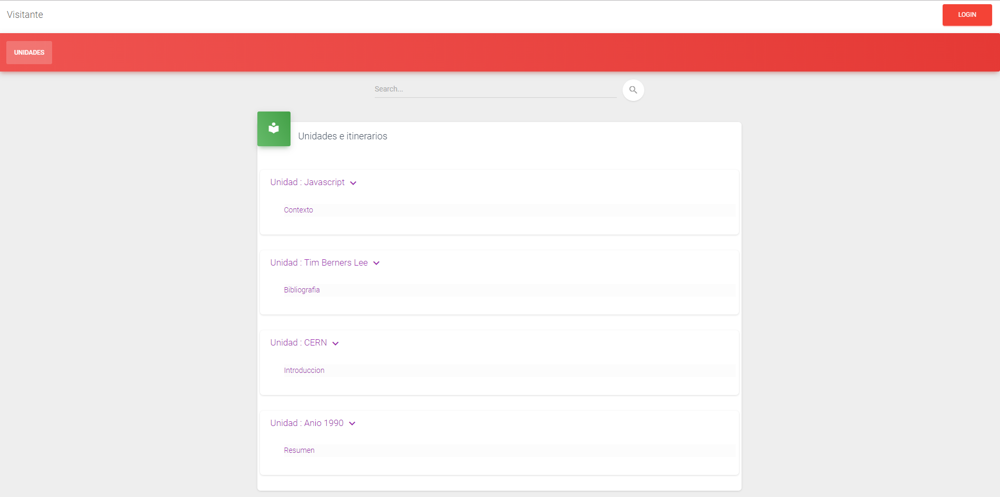

## Unit

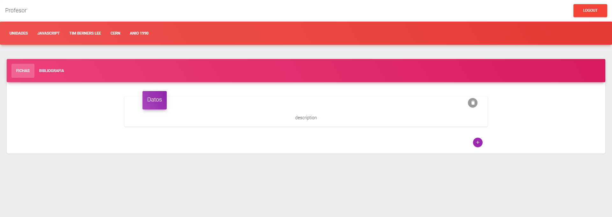

## Itinerary

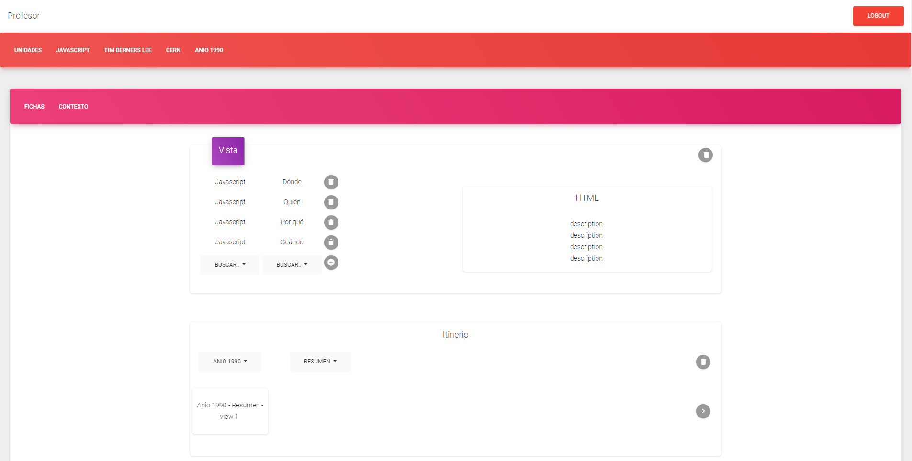

## Login

## Register

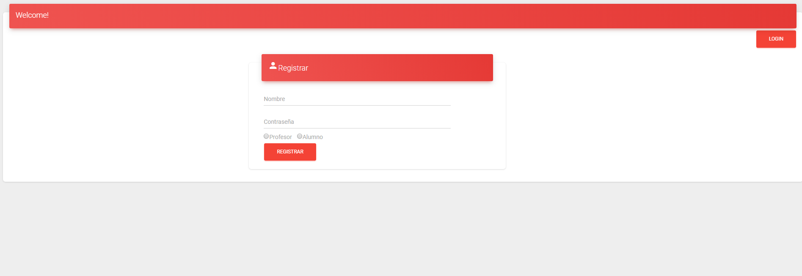

## Error Page

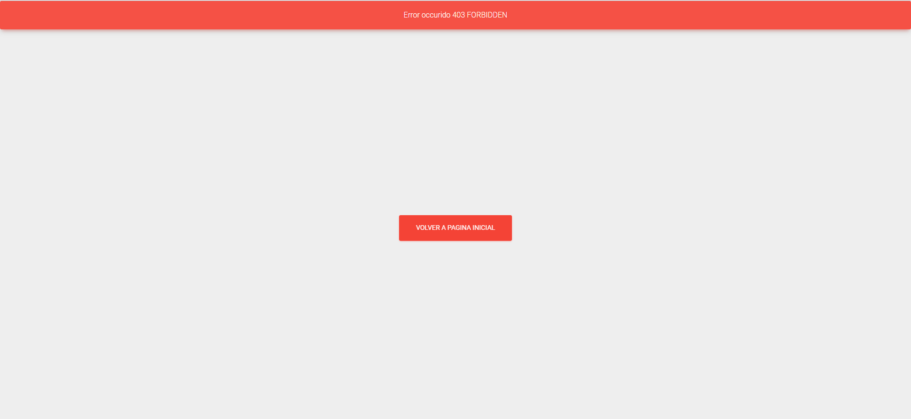

# Entity diagram

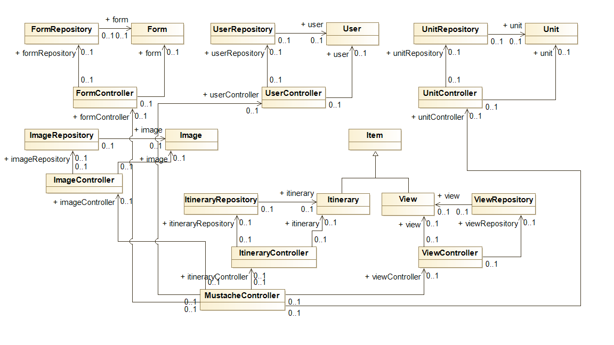
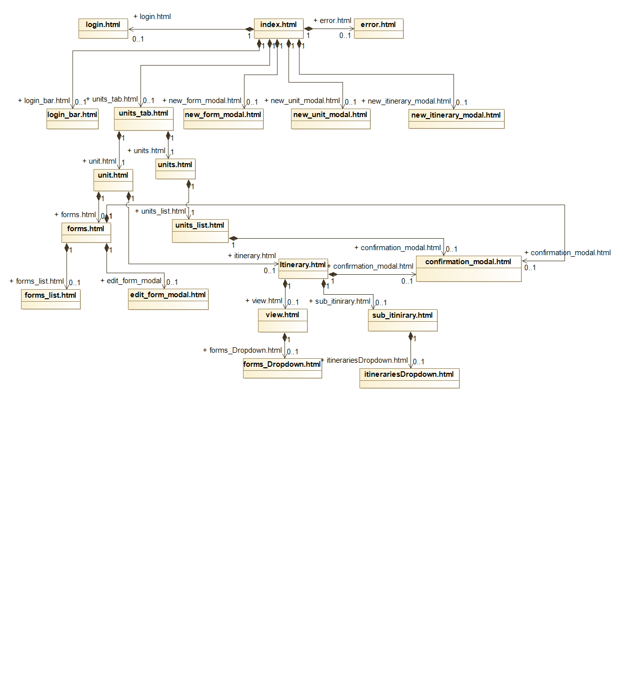

# Phase 3:
## Doc about API Rest
 
To begin, we will explain the functioning of the REST API that we have developed:

- For each type of entity that owns the application, the 4 main functionalities have been implemented: request (GET), create an object and add it to the database (POST), modify an object (PUT) and delete an object (DELETE) .

- The result that we obtain from each request is the requested object, except when we are using images, for which the image is returned. The object is shown in Json format, and can show up to two depth levels with respect to dependencies that have some objects over others.

- The data is passed to these methods as parameters that call the function or as attachments in the body of the request (with the annotation @RequestBody ...)

Our objects are:
    - View
    - Unit
    - Itinerary
    - Image
    - Form
    - Image
    - User
    
### URLs
    
    All our URLs will start with: https://localhost

    Then all our URLs related to the REST API will have the following format: first, it will be / api and then it will be / (the entity to which you want to access).

## api
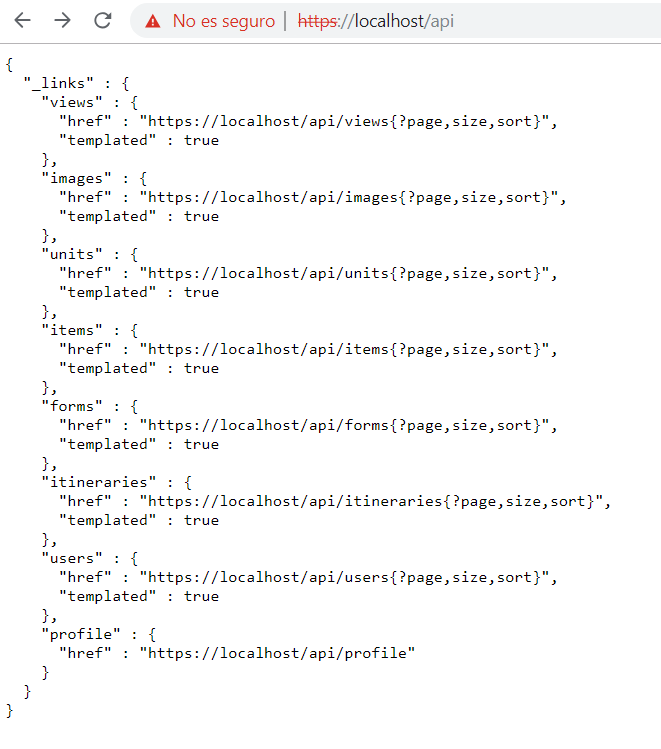
This URL shows diferent API REST
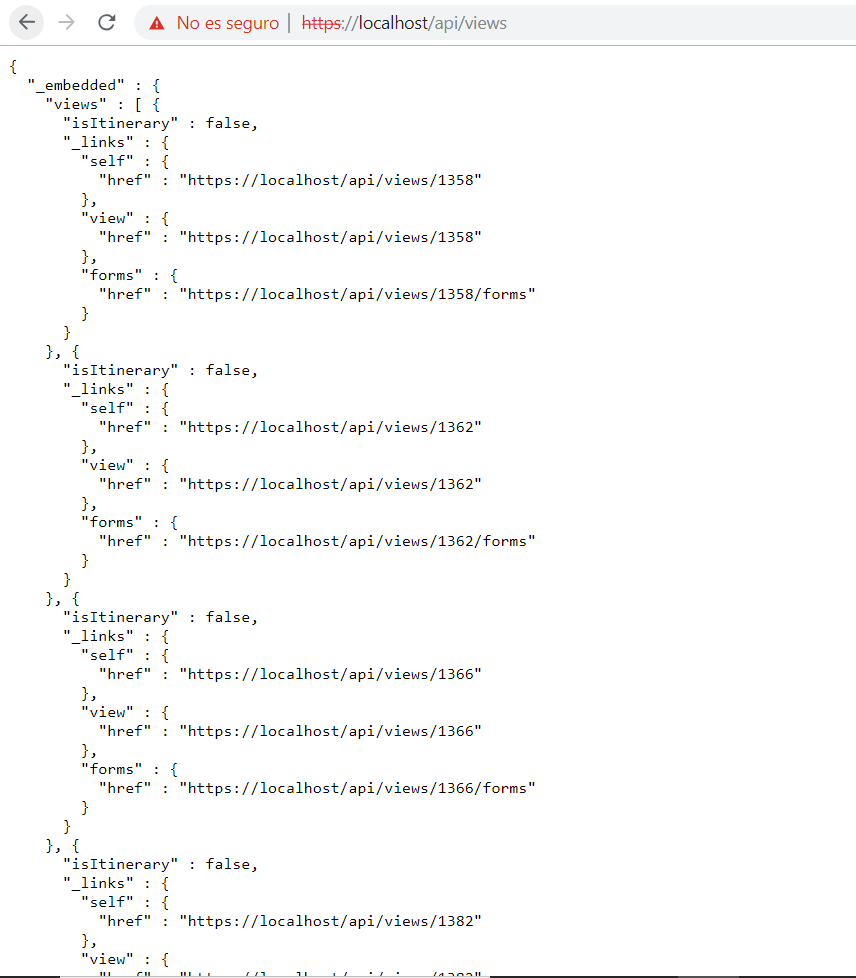
This URL shows a views lists 
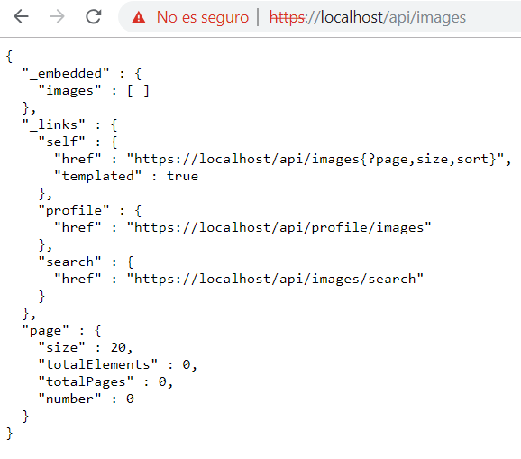
This URL shows an images uploaded
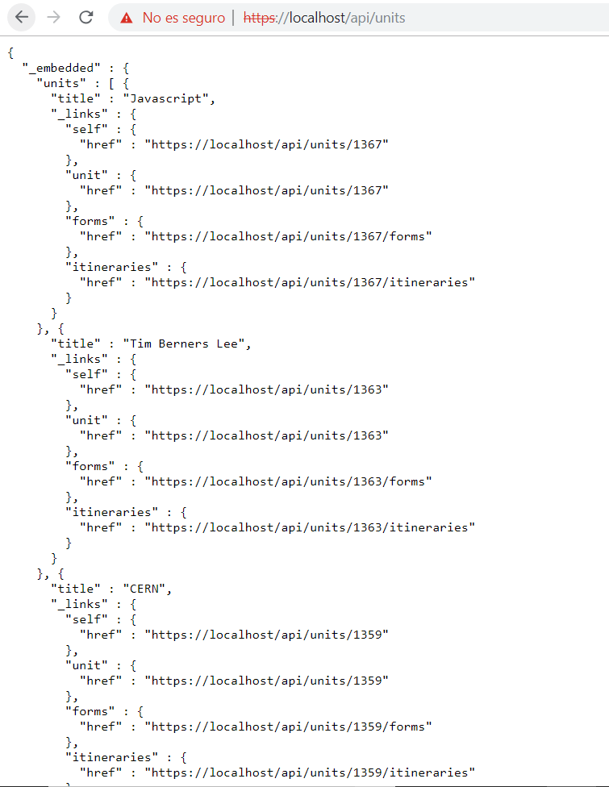
This URL shows an units lists
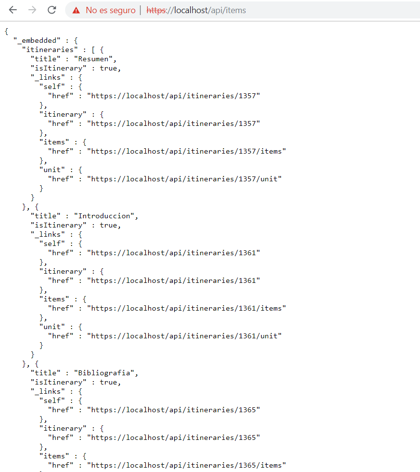
This URL shows an items lists
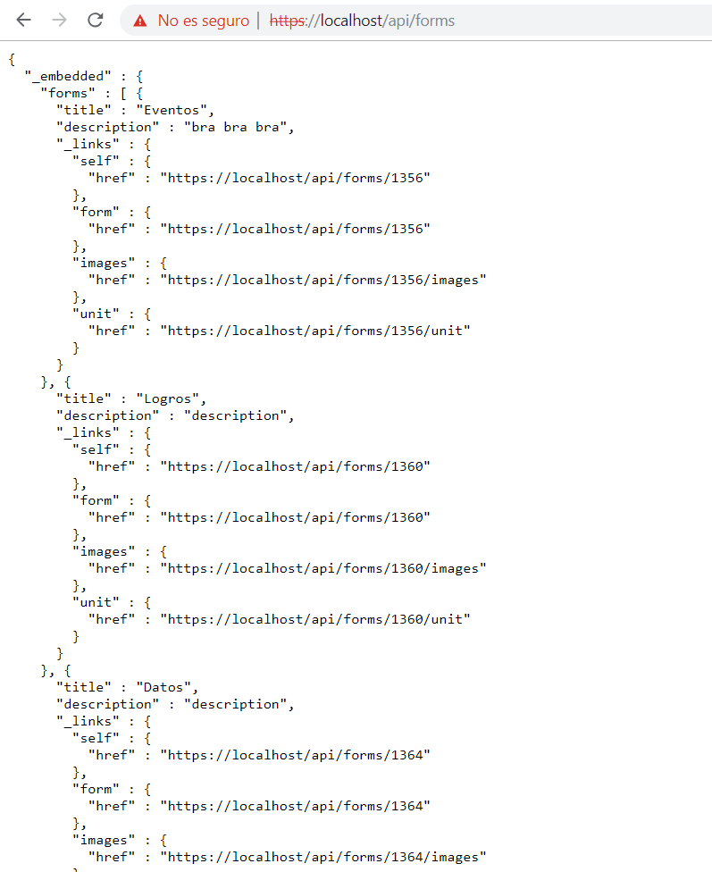
This URL shows a forms lists

This URL shows an itineraries lists
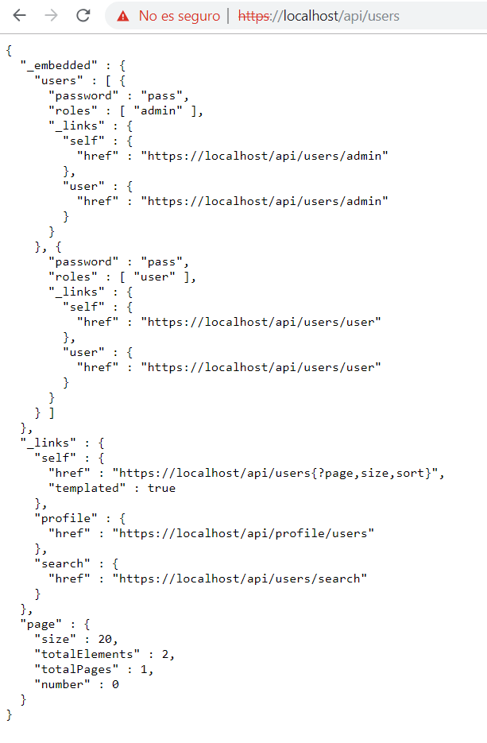
This URL shows users list
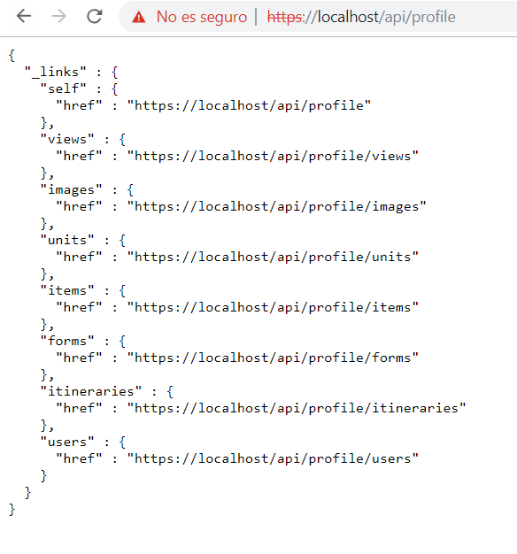
######EX:
- https://localhost/api/units/1367               One unit
- https://localhost/api/units/1367/forms         Form of this unit
- https://localhost/api/units/1367/itineraries   Itineraries of this unit

- https://localhost/api/views/136                One view
- https://localhost/api/views/1366/forms         Forms of this view

    All our URLs will start with: https://localhost .
    Then all our URLs related to the REST API will have the following format: first, it will be /api and then it will be / (the entity to which you want to access).

## How to install docker

- Go to docker website
- Depending on your system, download docker toolbox
- Select in which folder will be installed docker toolbox
- In settings, select components you need to install
- Install it and docker will be ready to use