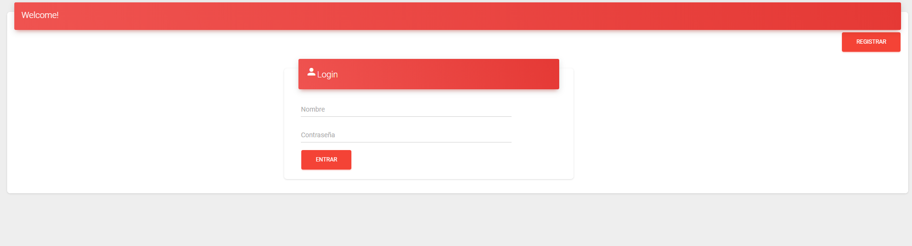
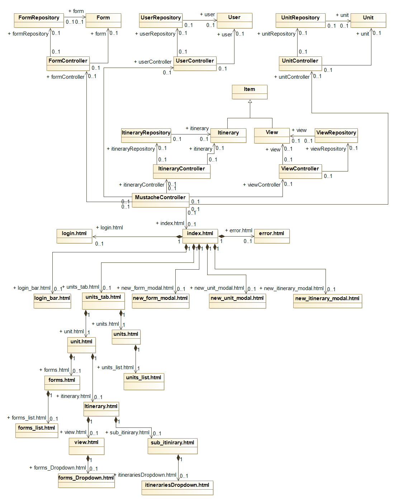

# Gestor de Itinerarios

## Description
We must create a website, a "Gestor de Itinearios", the development of this work will be evaluated by phases, being the distribution of them as follow:
* Phase 0: Form the development team (Not evaluable)
* Phase 1: Layout of pages with HTML and CSS Bootstrap (Not evaluable)
* Phase 2: Implementation of the web with HTML generated in server and AJAX.
* Phase 3: Incorporation of REST API to the web application and deployment with docker
* Phase 4: Implementation of the web with SPA architecture

## Team Members

Name | University email | GitHub Account
------------ | ------------------------- | -------------
ShuXiang Gao | s.gao.2016@alumnos.urjc.es | vitaminac
ZiYao Zhan | z.zhan.2016@alumnos.urjc.es | 13757851340x
Jorge José Vega Espinar | jj.vega.2016@alumnos.urjc.es | cobramarley
Raúl Colino Singh | r.colinos.2016@alumnos.urjc.es | imRCS
Rubén Zarapuz Juárez | r.zarapuz.2016@alumnos.urjc.es | Ruben98Z

**Our Trello:** [Link to the board](https://trello.com/invite/b/CFMjhg2A/1ff5190ce7e6a0f923e44a404e82d269/daw-g8)

# Start-up of the application
For running the application, you need to download this folder, unzip them and run the application with some development environment wich one have implemented the libraries that Spring needs, later you must change the port of your BBDD to 3306, the web server is already implemented if you use STS in the port 443. If you use another one, just change the port of your web server to this.

The project must be imported like a new gradle project.
You must create a database with the following parameters.

# MySQL Configuration
## Start up
docker-compose up

## Connections Parameters
### Database name
daw

### Username
daw

### Password
daw_grupo_7

## Tasks
### Phase 0:
- [x] Form a team

### Phase 1:
- [x] Distribute tasks to each one in trello
- [x] [Phase 1 Requirements] (https://docs.google.com/document/d/1cW3UCiqWrq4Fk3JF0MOUjiyEdfOuw9rs257IqyN8ILs/edit?usp=sharing)
- [x] Upload code to GitHub
- [x] Merge all the work

### Phase 2:
- [x] Complete functionality for visitors
- [x] Complete functionality for students
- [x] Complete functionality for the teacher
- [ ] The application contains errors
- [x] Lists of more than 10 items are paged with "load more" (AJAX)
- [x] Image upload is allowed
- [x] The application is accessible by https
- [x] There is access control by role and URL (students can not access administrator URLs)
- [x] The code and comments are in English
- [x] The code has an appropriate format and style?
- [x] The error page when you put an incorrect URL has the same style as the others?
- [x] The documentation contains a navigation diagram with updated screenshots
- [x] Does the documentation contain a diagram with the entities in the database?
- [x] The documentation contains a diagram with the classes (drivers, services, repositories, etc ...)
- [x] The documentation contains a section with instructions on how to configure the development environment and how to develop the application

# Views in Phase 1 (Screenshots)

# Falta:
# Views in Phase 2 (Screenshots)

# Navigation diagram

## Overview

## Unit

## Itinerary

## Login

## Register

## Error Page

# Entity diagram

